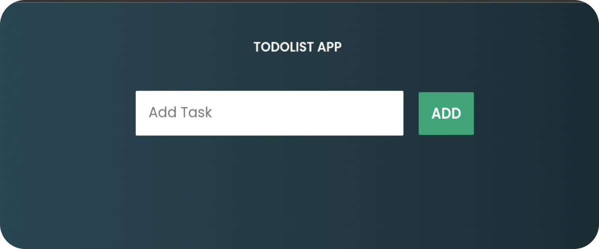

<h1>Todolist 🗒️</h1>

<h2>🔖 Descrição</h2>

Uma to do list é uma lista de tarefas, de coisas que precisam ser feitas.

<h2>🚀 Tecnologias</h2>

<ul>
    <li><a href="https://developer.mozilla.org/en-US/docs/Web/HTML" target="_blank">Html</a></li>
    <li><a href="https://www.w3schools.com/css/" target="_blank">Css</a></li>
    <li><a href="https://developer.mozilla.org/en-US/docs/Web/JavaScript" target="_blank">JavaScript</a></li>
</ul>

<h2>Clique aqui e visite a aplicação:</h2>
<a href="https://todoistsimplejs.netlify.app/" target="_blank">TodoList</a>

 
 

Criado com 💙 por <a href="https://github.com/guusfelix2015/mini-projetcs-js/tree/main/project-02-todolist" target="_blank">Gustavo Felix</a>

