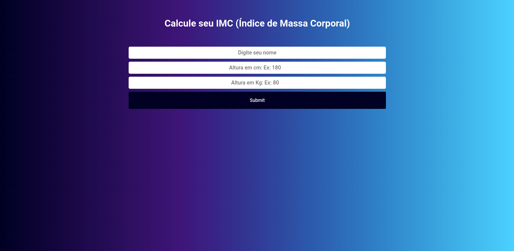

# Mini Projetos com javascript puro 👨‍💻

## Objetivo ✨

Não tem outra maneira para se aprender além de **praticar, praticar e praticar**.

Pensando nisso, criei este repositório com objetivo juntar ideias para mini projetos praticar meus conhecimentos com javascript puro.

Se gostou da ideia acompanhe os projetos abaixo:

<table border="2">
  <tr>
    <td>
        <h3>01 - Calculadora IMC</h3>
        <li><a href="https://github.com/guusfelix2015/mini-projetcs-js/tree/main/project-01-IMC">Código</a></li>
        <li><a href="calculateimcjs.netlify.app">Clique para testar</a></li>
        
    </td>
  </tr>
  
</table>
